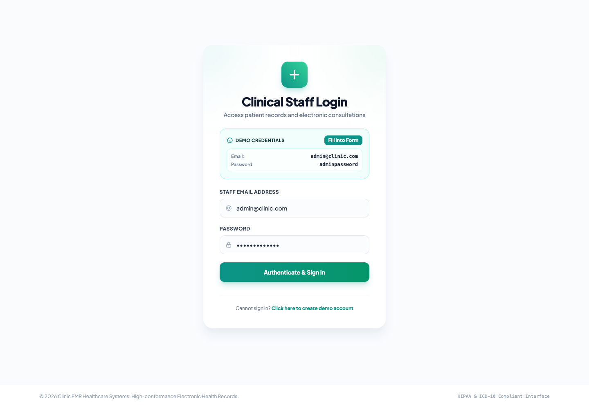
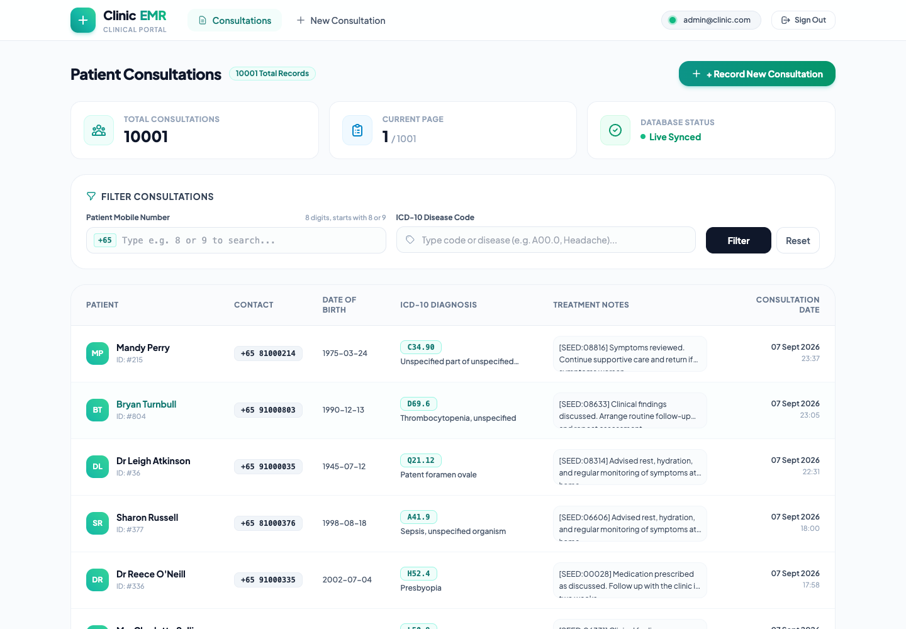
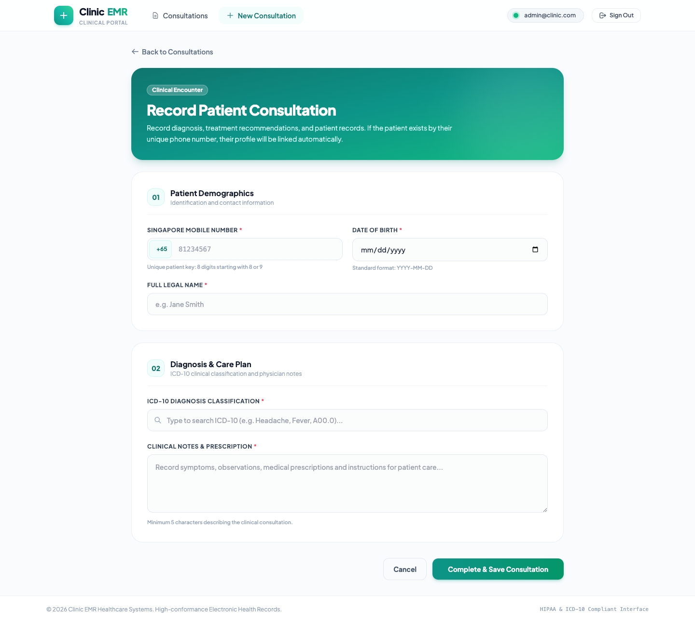

# Clinic EMR

Clinic EMR is a demo electronic medical record application built with FastAPI,
Nuxt 3, SQLAlchemy, and SQLite.

## Run With Docker

### Requirements

- Docker Desktop or Docker Engine with Docker Compose
- Ports `3000` and `8000` available

### Start The Demo

```bash
docker compose -f docker-compose.demo.yaml up --build
```

The first startup runs database migrations and creates the demo dataset:

- One administrator account
- 100 representative ICD-10 seed codes
- 1,000 generated patients
- 10,000 generated consultations

Open the services after the containers become healthy:

- Frontend: http://localhost:3000
- Backend API: http://localhost:8000
- Swagger UI: http://localhost:8000/docs

Default login:

```text
Email: admin@clinic.com
Password: adminpassword
```

## Web Usage Guide

### 1. Sign In

Open http://localhost:3000 and sign in with the demo credentials shown above.
The login form is prefilled when the application runs in demo mode.



### 2. Browse And Filter Consultations

The home page displays consultation history with pagination. Use the filters to
find records by a patient's Singapore mobile number or ICD-10 disease code.



### 3. Record A Consultation

Select **New Consultation**, enter the patient demographics, choose an ICD-10
diagnosis, and add the clinical notes. Existing patients are matched by their
unique mobile number.



Run the containers in the background:

```bash
docker compose -f docker-compose.demo.yaml up --build -d
```

View logs:

```bash
docker compose -f docker-compose.demo.yaml logs -f
```

Stop the demo while preserving its database:

```bash
docker compose -f docker-compose.demo.yaml down
```

Reset the demo and delete its database volume:

```bash
docker compose -f docker-compose.demo.yaml down -v
docker compose -f docker-compose.demo.yaml up --build
```

### Override Demo Credentials

Set environment variables before starting Compose:

```bash
DEMO_SECRET_KEY="replace-with-a-long-random-secret" \
DEMO_ADMIN_EMAIL="doctor@example.com" \
DEMO_ADMIN_PASSWORD="replace-with-a-strong-password" \
DEMO_ADMIN_NAME="Demo Doctor" \
docker compose -f docker-compose.demo.yaml up --build
```

The default credentials and secret are intended for local demonstrations only.

If ports `3000` or `8000` are already in use, override the host ports and API
URL together:

```bash
DEMO_FRONTEND_PORT=13000 \
DEMO_BACKEND_PORT=18000 \
DEMO_API_URL=http://localhost:18000 \
docker compose -f docker-compose.demo.yaml up --build
```

## Run Locally

### Backend

The backend requires Python 3.9 or newer.

```bash
cd backend
python3 -m venv venv
source venv/bin/activate
pip install -r requirements.txt
cp .env.example .env
alembic upgrade head
python -m app.db.seed_demo
uvicorn app.main:app --reload --host 0.0.0.0 --port 8000
```

### Frontend

In another terminal, run:

```bash
cd frontend
npm install
cp .env.example .env
npm run dev
```

The frontend development server is available at http://localhost:3000.

## Project Structure

```text
clinic-emr/
|-- backend/                  FastAPI API, SQLAlchemy models, and seed scripts
|-- frontend/                 Nuxt 3 single-page application
|-- docker-compose.demo.yaml  Complete local demo stack
`-- README.md                 Project setup instructions
```
